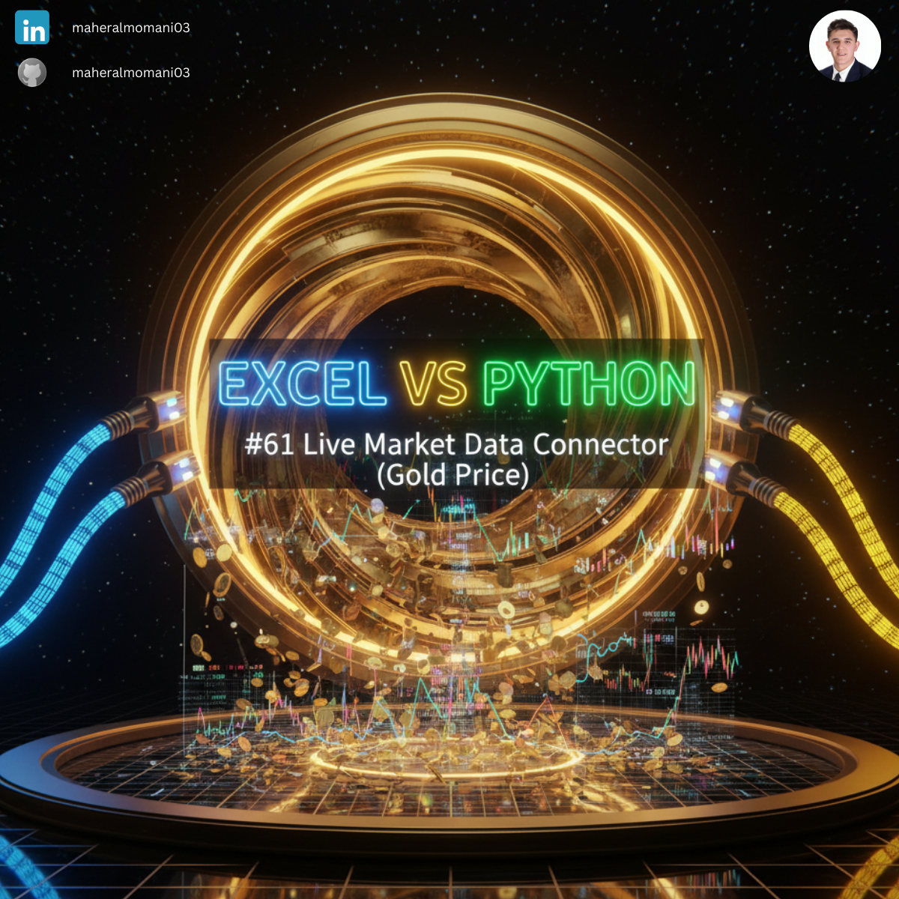
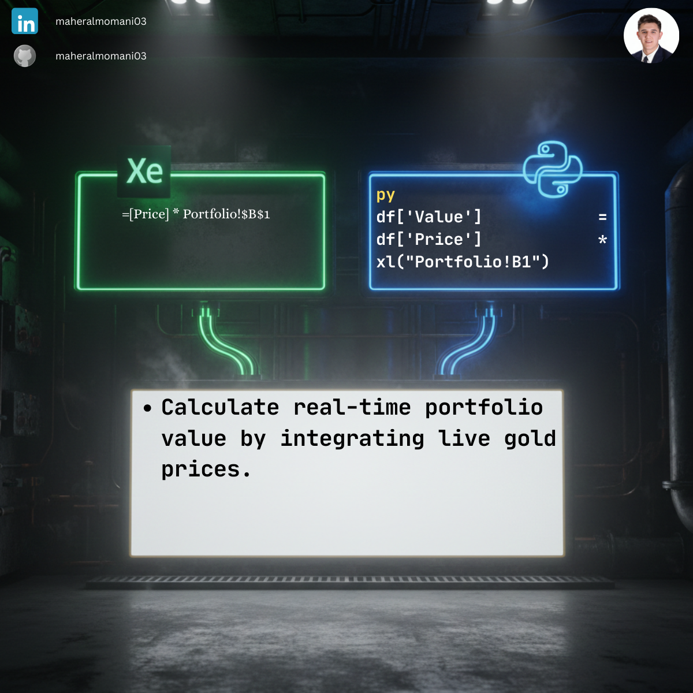

# 🟡 Day 61: Live Market Data Connector (Gold Price)

### 🎯 Objective
Connecting financial models directly to live market data (like gold or commodities) to ensure that asset valuations are always current and accurate.

### 💼 Accounting Context
* **Fair Value Accounting:** Essential for companies holding commodities or precious metals to report assets at market value.
* **Risk Management:** Real-time monitoring of raw material price fluctuations for manufacturing costs.

### 📗 Excel Approach
**Logic:**
Using "Data Types" or Power Query to pull web data, which often requires manual refresh.

### 🐍 Python Approach
**Logic:**
Instantly accesses the data frame values for programmatic adjustments in complex valuation models without manual intervention.

### 📊 Visual Reference
