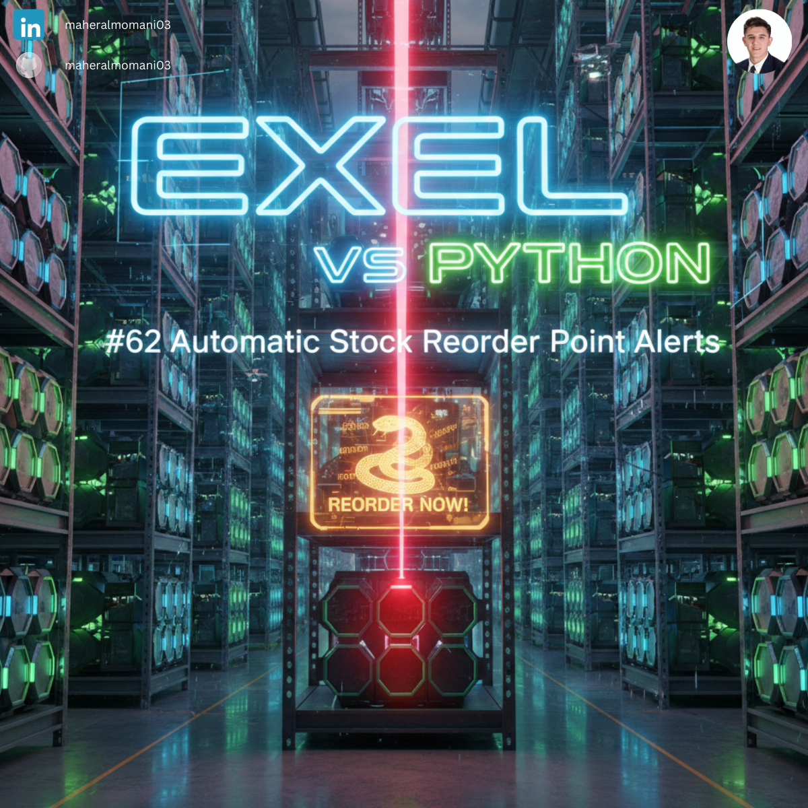
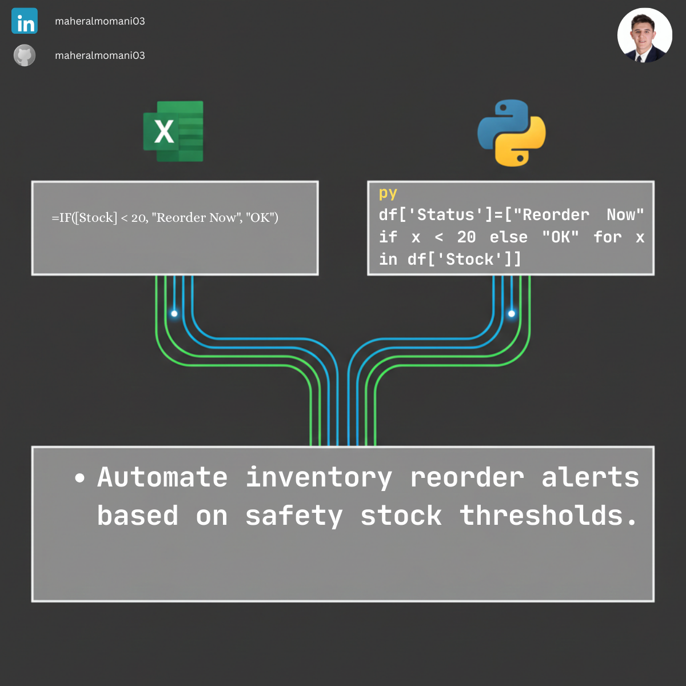

# 📦 Day 62: Automatic Stock Reorder Point Alerts

### 🎯 Objective
Automating inventory monitoring to flag items that have dropped below their safety stock levels, preventing operational downtime and stockouts.

### 💼 Accounting Context
* **Supply Chain Efficiency:** Minimizing opportunity costs and maximizing inventory turnover.
* **CMA Topic:** Directly related to "Inventory Management" and "Economic Order Quantity (EOQ)" concepts.

### 📗 Excel Approach
**Formula:** `=IF(B2 < C2, "Reorder", "OK")`

### 🐍 Python Approach
**Logic:**
Automatically generating a separate "Action List" of only the items that need attention, which can be emailed directly to the procurement department.

### 📊 Visual Reference
