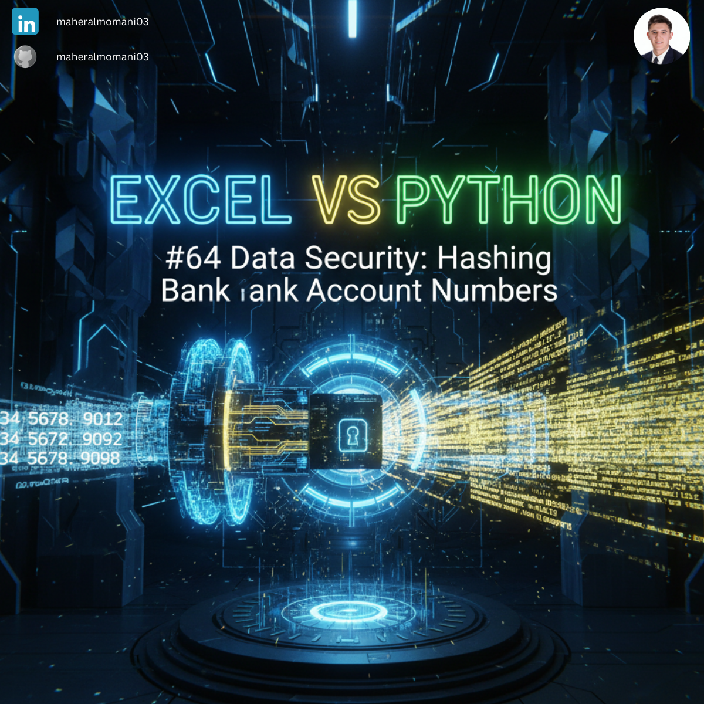
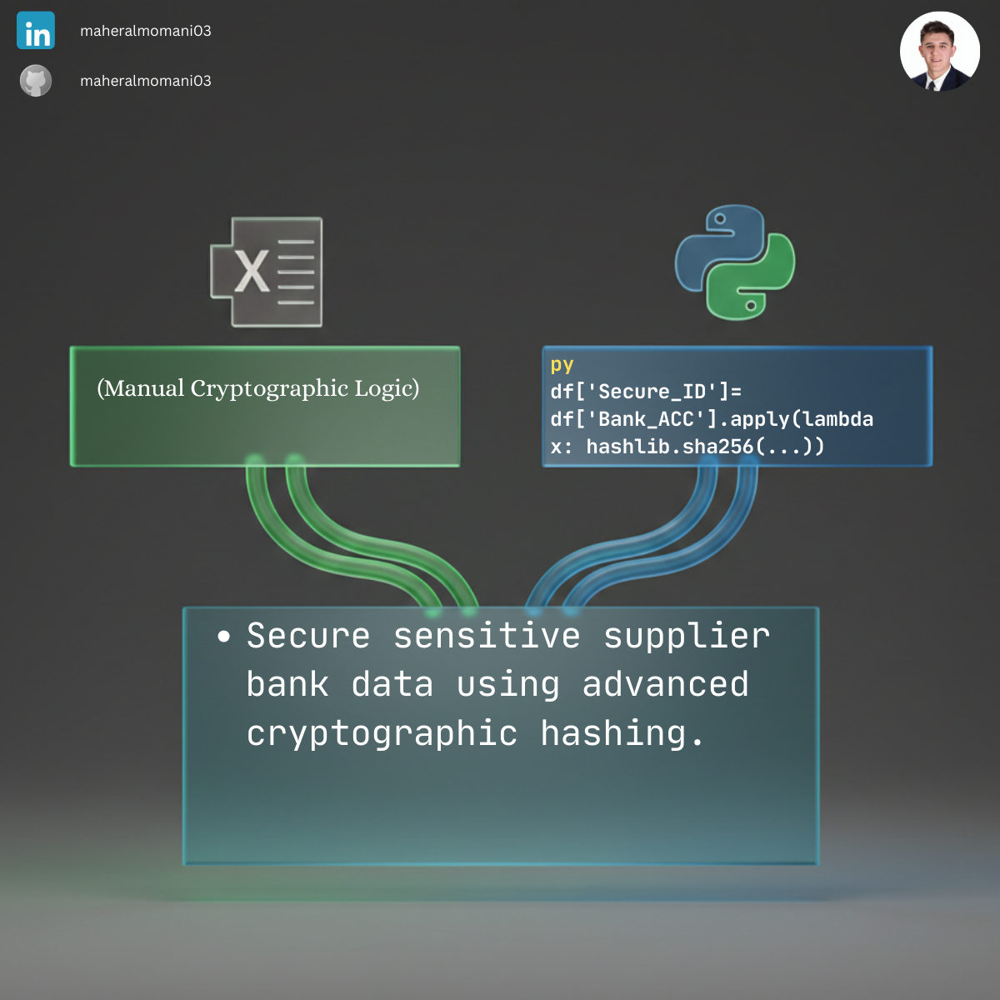

# 🔒 Day 64: Data Security: Hashing Bank Account Numbers

### 🎯 Objective
Implementing irreversible data protection (Hashing) for sensitive bank account details. This is the gold standard for securing financial data while maintaining the ability to verify transactions.

### 💼 Accounting Context
* **Cybersecurity in Accounting:** Protecting against data breaches and unauthorized access to banking infrastructure.
* **Internal Controls (COSO):** Strengthening the "Information and Communication" component by securing sensitive master data.

### 📗 Excel Approach
**Logic:**
Excel does not have a built-in hashing function. Users often have to rely on complex VBA scripts or external add-ins, which can be risky.

### 🐍 Python Approach
**Logic:**
Uses the industry-standard `hashlib` library to create a unique, fixed-length string (fingerprint) for each account number. Unlike Excel, Python makes this high-level security accessible and automated.

### 📊 Visual Reference
