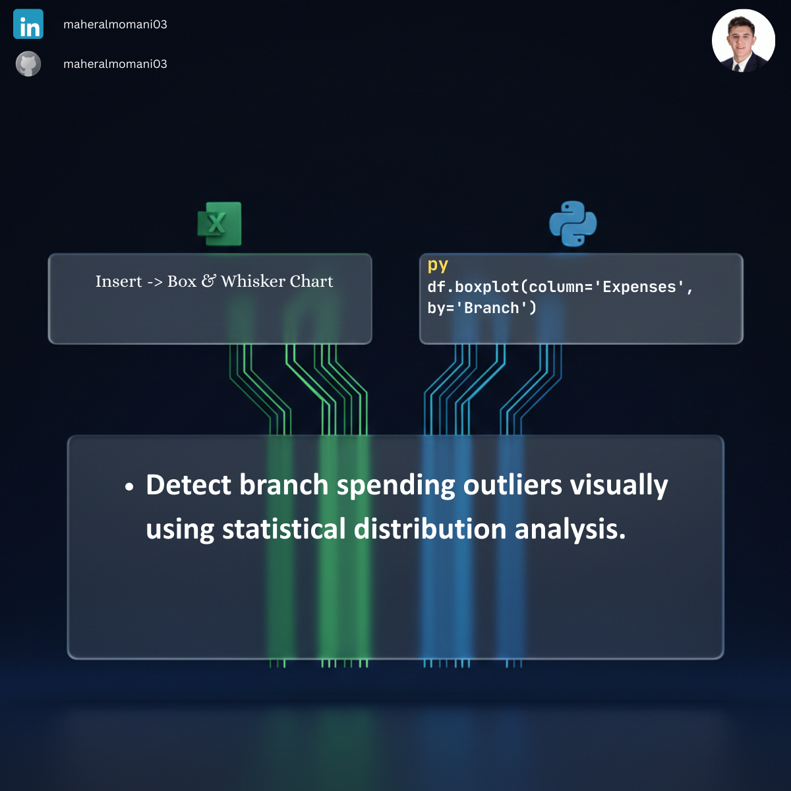

# 📦 Day 65: Branch Expense Distribution Analysis (Box Plot)

### 🎯 Objective
Using Box Plots (Whisker Plots) to visualize the distribution, median, and outliers of expenses across different company branches. This helps in identifying unusual spending patterns or process inefficiencies.

### 💼 Accounting Context
* **Internal Auditing:** Identifying outliers (extreme spending) that may require further investigation for fraud or waste.
* **Cost Variation Analysis:** Understanding if certain branches have higher variability in their cost structures compared to others.
* **Operational Benchmarking:** Visualizing the spread of operational data to set more realistic budgets.

### 📗 Excel Approach
**Tool:**
Insert > Statistical Chart > Box and Whisker.

### 🐍 Python Approach
**Logic:**
Using `df.boxplot()` allows for rapid comparison across multiple categories (Branches) in a single command, making it highly efficient for large datasets.

### 📊 Visual Reference
