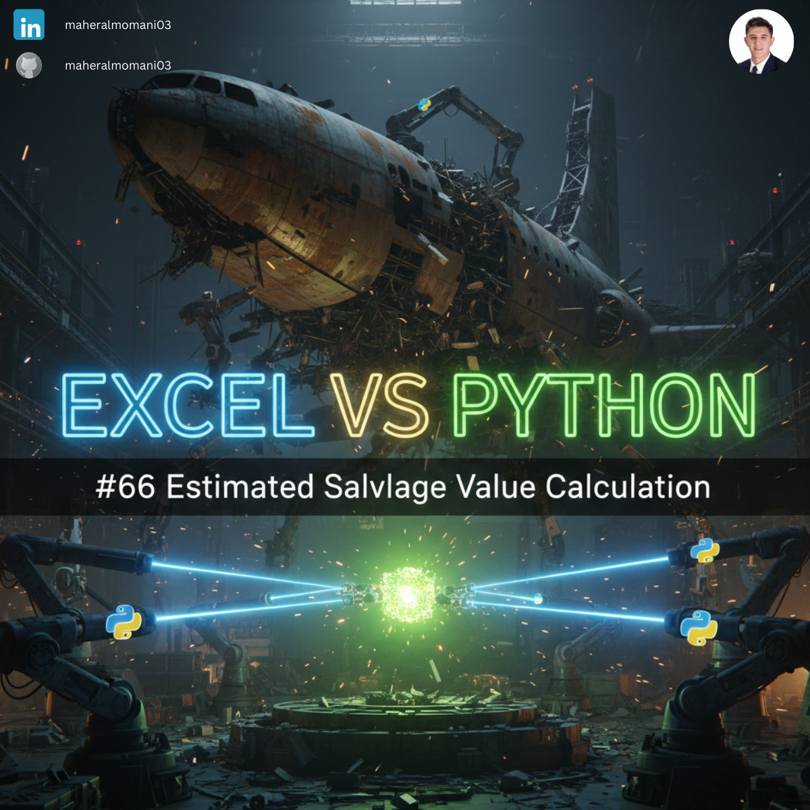
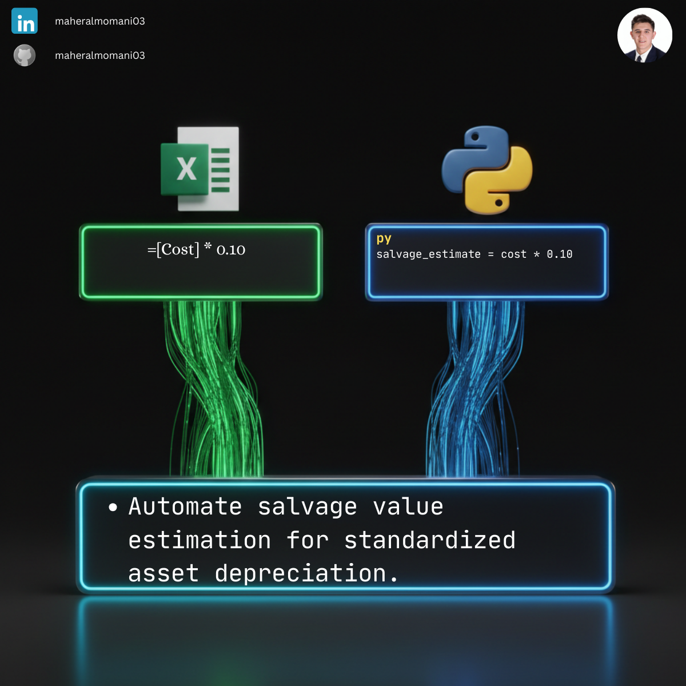

# 🚜 Day 66: Automated Estimated Salvage Value Calculation

### 🎯 Objective
Automating the estimation of an asset's salvage value—the residual value at the end of its useful life—as a standard percentage of its initial cost.

### 💼 Accounting Context
* **Depreciation Basis:** Salvage value is a critical input for calculating depreciation expense (Cost - Salvage).
* **Financial Planning:** Predicting future cash inflows from asset disposals.
* **CMA Core Concept:** Fundamental to "Long-term Asset Management" and "Accounting Estimates."

### 📗 Excel Approach
**Formula:**
`=Salvage_Table[@Cost] * 0.1`

### 🐍 Python Approach
**Logic:**
Vectorized calculation that applies standard salvage rules across thousands of assets instantly, reducing manual clerical errors.

### 📊 Visual Reference
