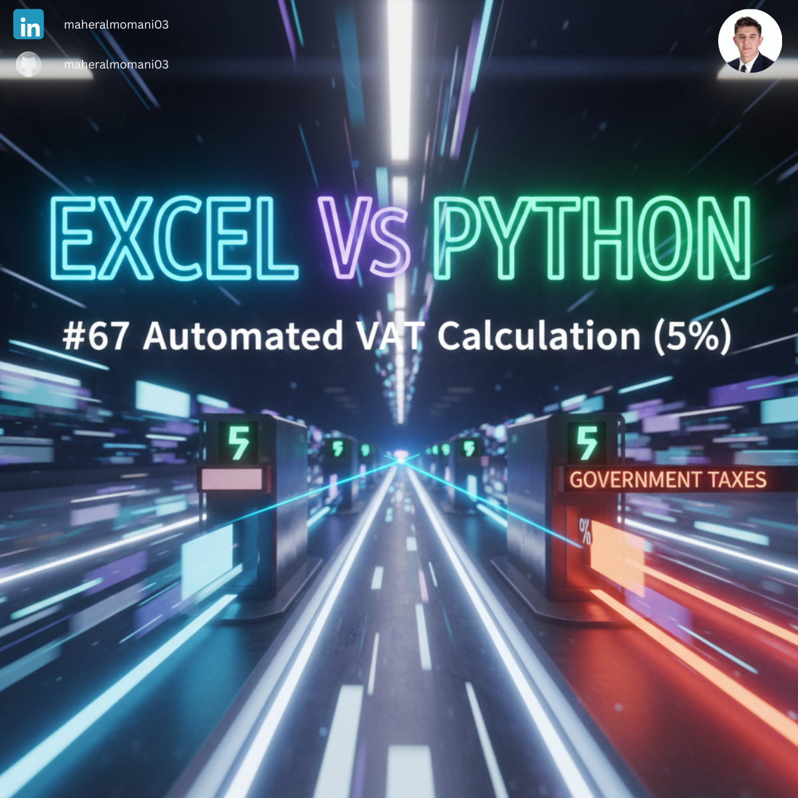
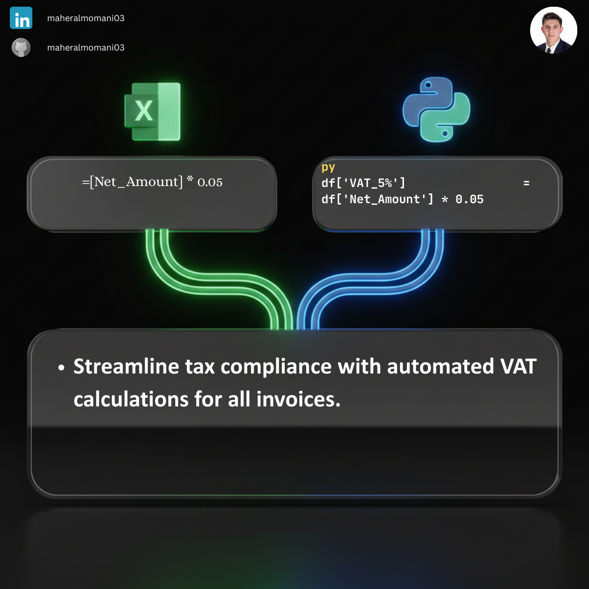

# 🧾 Day 67: Automated VAT Calculation (5%)

### 🎯 Objective
Automating the calculation of Value Added Tax (VAT) for financial transactions to ensure tax compliance and accurate invoicing.

### 💼 Accounting Context
* **Tax Compliance:** Ensuring all taxable supplies have the correct rate applied for periodic tax filings.
* **Revenue Recognition:** Separating gross sales into net revenue and tax liabilities on the balance sheet.
* **Audit Trail:** Providing a clear, programmable logic for how taxes were computed across all ledger entries.

### 📗 Excel Approach
**Formula:**
`=VAT_Table[@Net_Amount] * 0.05`

### 🐍 Python Approach
**Logic:**
Fast and secure batch processing of invoices, which can be easily adapted for multiple tax jurisdictions or tiered rates.

### 📊 Visual Reference
