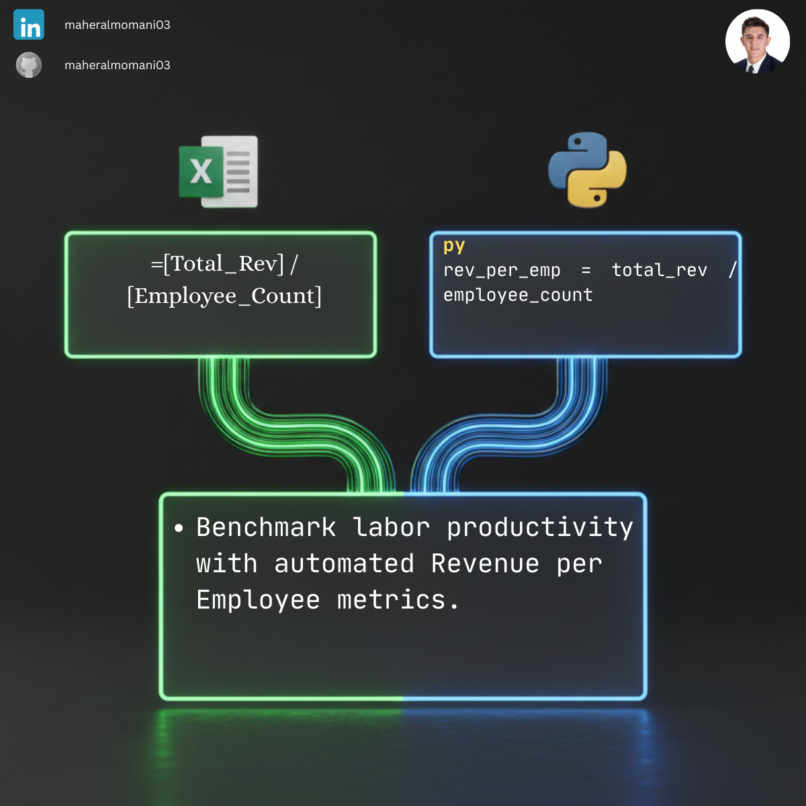

# 👥 Day 68: Key Metric: Revenue per Employee Ratio

### 🎯 Objective
Measuring the efficiency and productivity of the workforce by determining the average revenue generated by each employee.

### 💼 Accounting Context
* **Productivity Benchmarking:** Comparing organizational efficiency against industry competitors.
* **Resource Management:** Helping management decide on hiring needs or workforce optimization strategies.
* **CMA Ratio Analysis:** A vital operational efficiency metric for evaluating business performance.

### 📗 Excel Approach
**Formula:**
`=Revenue_Metrics[@Total_Rev] / Revenue_Metrics[@Employee_Count]`

### 🐍 Python Approach
**Logic:**
Automating ratio trends over multiple periods or departments to visualize human capital ROI instantly.

### 📊 Visual Reference
