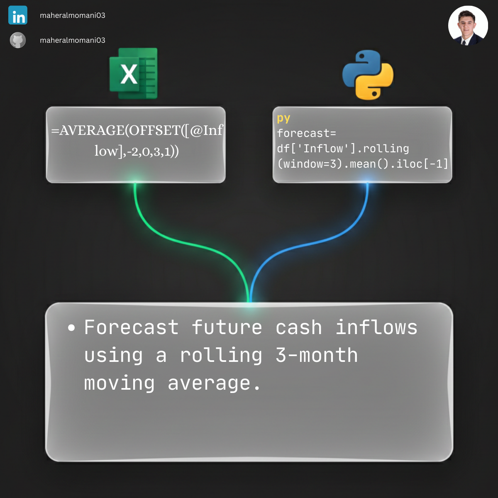

# 🔮 Day 69: Cash Flow Forecasting (3-Month Moving Average)

### 🎯 Objective
Using historical cash inflow data to forecast future performance using the rolling mean (moving average) method, which smoothes out short-term fluctuations.

### 💼 Accounting Context
* **Liquidity Planning:** Anticipating future cash availability to plan for capital expenditures or debt repayments.
* **Budgeting & Forecasting (CMA):** Providing a data-driven baseline for the master budget.
* **Risk Mitigation:** Identifying downward trends early to take corrective action before liquidity crises occur.

### 📗 Excel Approach
**Formula:**
`=AVERAGE(OFFSET(B4, -2, 0, 3, 1))`

### 🐍 Python Approach
**Logic:**
Uses the `.rolling()` function to automatically handle sliding window calculations, which is far more flexible and less prone to range errors than Excel's `OFFSET`.

### 📊 Visual Reference
