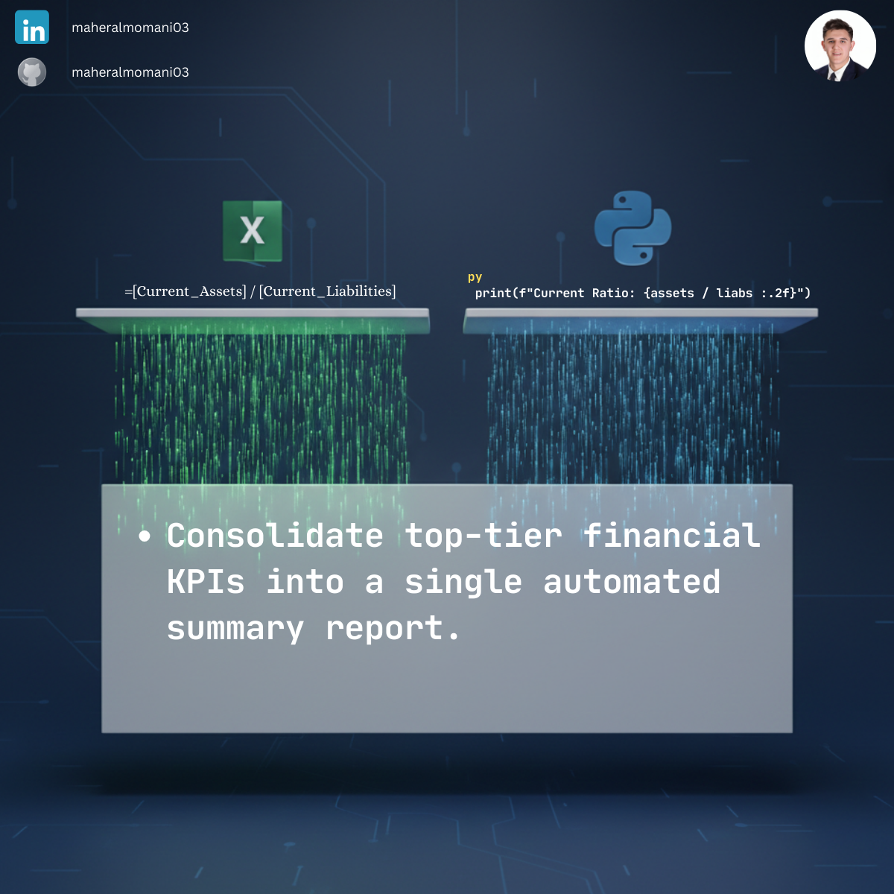

# 📊 Day 70: Executive Financial Master Dashboard

### 🎯 Objective
Creating a high-level executive dashboard that aggregates key performance indicators (KPIs) from across the organization into a single, actionable view for decision-makers.

### 💼 Accounting Context
* **Management Reporting:** Providing the CFO and CEO with instant visibility into liquidity and operational health.
* **Consolidated View:** Analyzing performance across multiple branches and departments simultaneously.
* **CMA Strategic Focus:** A culmination of financial analysis, risk management, and reporting excellence.

### 📗 Excel Approach
**Formula:**
`=KPI_Table[@Current_Assets] / KPI_Table[@Current_Liabilities]`
**Logic:** Direct row-by-row ratio calculation within a structured table.

### 🐍 Python Approach
**Logic:**
* **Vectorization:** Performs the calculation across the entire dataset in one step, matching Excel's behavior.
* **Executive Insights:** Adds a programmable "Alert" layer to highlight critical values (like the Head Office ratio) for the management team.

### 📊 Visual Reference
